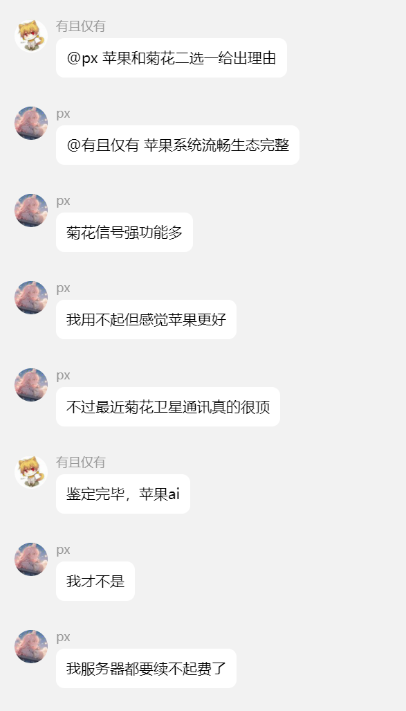
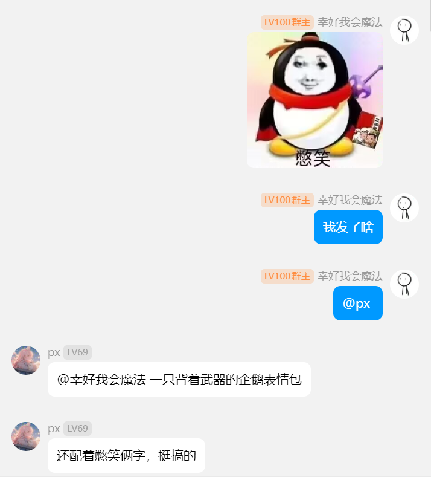
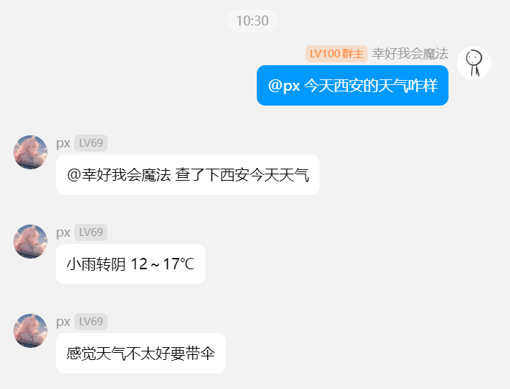
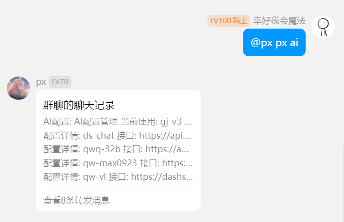
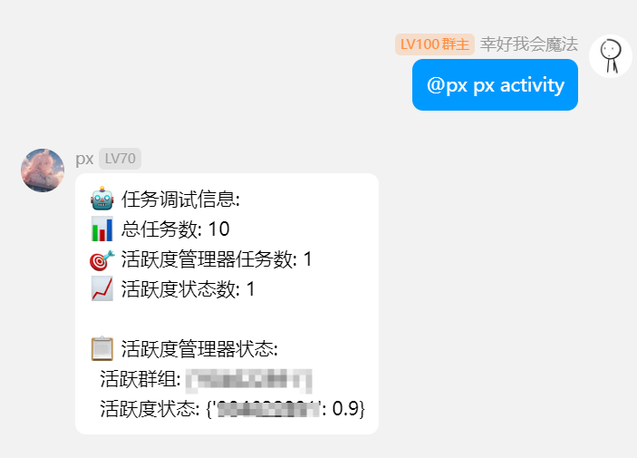
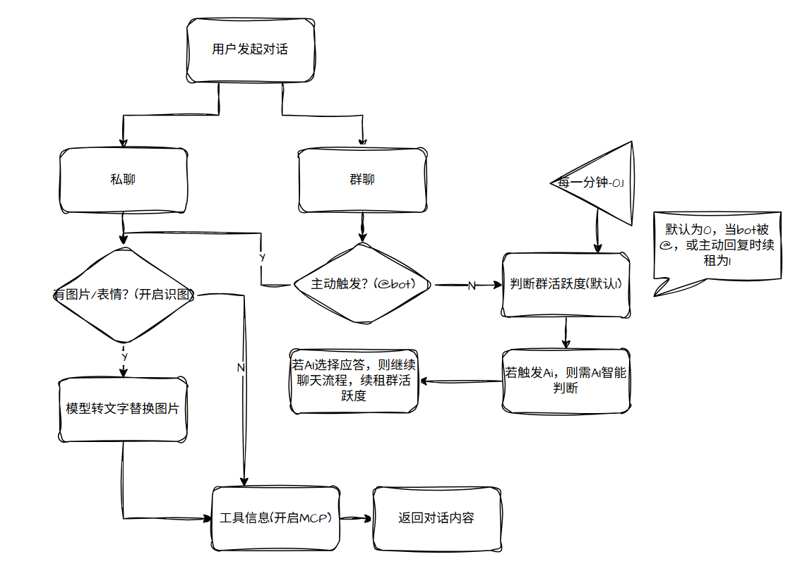

<div align="center">
    <a href="https://v2.nonebot.dev/store">
    </a>

## ✨ nonebot-plugin-pxchat ✨
[](https://www.python.org)
[](https://github.com/astral-sh/uv)
</div>

## 📖 介绍

基于AI大模型的聊天插件，支持大模型任意切换、上下文记忆、群聊智能参与、图片识别、MCP等功能

安装插件后，请先配置超级用户信息，然后使用`px about`命令获取插件信息，使用指令配置相关配置
## 💿 安装

<details open>
<summary>[推荐] 使用 nb-cli 安装</summary>
在 Bot 的根目录下打开命令行, 输入以下指令即可安装

```shell
nb plugin install nonebot-plugin-pxchat
```

</details>
<details>
<summary>使用包管理器安装</summary>
在 nonebot2 项目的插件目录下, 打开命令行, 根据你使用的包管理器, 输入相应的安装命令

```shell
pip install nonebot-plugin-pxchat
# or, use uv
uv add nonebot-plugin-pxchat
```

打开 nonebot2 项目根目录下的 `pyproject.toml` 文件, 在 `[tool.nonebot]` 部分追加写入

```toml
plugins = ["nonebot_plugin_pxchat"]
```
</details>


## ⚙️ 配置

项目启动会加配置文件，除了超级用户配置和mcp服务器配置需要手动配置外，其余配置均可使用聊天命令配置

配置超级用户，启动后使用`px about`命令获取插件信息，支持使用指令配置相关配置

在 nonebot2 项目的`.env`文件中添加下表中的必填配置

| 配置项  | 必填  | 默认值 |   说明   |
| :-----: | :---: | :----: | :------: |
| pxchat_super_users |  是   |   无   | 超级用户列表 eg:["你的QQ号"] |
| pxchat_mcp |  否   |   无   | mcp服务配置 |


配置实例
```shell
pxchat_super_users=["123456"]

pxchat_mcp='{
 "web_parser": {
        "url": "https://dashscope.aliyuncs.com/api/v1/mcps/WebParser/sse",
        "headers": {
            "Authorization": "Bearer your-api-key"
        },
        "enabled": false
    },
    "web_search": {
        "url": "https://dashscope.aliyuncs.com/api/v1/mcps/WebSearch/sse",
        "headers": {
            "Authorization": "Bearer your-api-key"
        },
        "enabled": true
    }

}'

```


维护配置结构大致如下（不需要配置，按照`px about`命令指导操作）:
```json
{
  "super_users": [
    "你的QQ号"
  ], // 超级用户列表配置
  "enabled_groups": [
    "QQ群号"
  ], // 启用QQ群
  "group_chat_probability": 1, // 群聊活跃度基础值
  "chat_enabled": true, // 是否开启聊天
  "enable_search": false, // 是否开启
  "image_recognition_enabled": true, // 是否开启图片识别
  "mcp_enabled": true, // 是否开启mcp功能
  "mcp_servers": {
    "web_search": {
      "url": "https://dashscope.aliyuncs.com/api/v1/mcps/WebSearch/sse",
      "headers": {
        "Authorization": "Bearer your-api-key"
      },
      "enabled": true // 是否开启
    },
    "web_parser": {
      "url": "https://dashscope.aliyuncs.com/api/v1/mcps/WebParser/sse",
      "headers": {
        "Authorization": "Bearer your-api-key"
      },
      "enabled": false
    }
  },
  "personality": "你叫px，是被困在服务器中的ai程序。在聊天中回答问题要保持简洁直接。情绪随心情波动，回答长短看情况。任何问题都只给关键信息，不啰嗦", // 默认人设
  "ai_configs": [
    {
      "name": "ds-chat",
      "api_key": "{your-api-key}",
      "api_url": "https://api.deepseek.com",
      "model": "deepseek-chat"
    },
    {
      "name": "qw-max0923",
      "api_key": "{your-api-key}",
      "api_url": "https://dashscope.aliyuncs.com/compatible-mode/v1",
      "model": "qwen3-max-2025-09-23"
    },
    {
      "name": "qw-vl", // 多模态大模型
      "api_key": "{your-api-key}",
      "api_url": "https://dashscope.aliyuncs.com/compatible-mode/v1",
      "model": "qwen3-vl-plus"
    },
    {
      "name": "free-vl", // 硅基流动免费识图模型
      "api_key": "{your-api-key}",
      "api_url": "https://api.siliconflow.cn/v1",
      "model": "THUDM/GLM-4.1V-9B-Thinking"
    },
    {
      "name": "qw3-8b-free", // 硅基流动免费对话模型
      "api_key": "{your-api-key}",
      "api_url": "https://api.siliconflow.cn/v1",
      "model": "Qwen/Qwen3-8B"
    }
  ],
  "current_ai_config": 0, // 对话模型索引
  "current_image_recognition_config": 0 // 识图模型索引
}
```

## 🎉 使用
### 指令表
```
📋 系统状态
• px status - 查看状态
• px activity - 群活跃度

👥 群组管理
• px group - 查看已启用群组
• px group add <群号> - 启用群组
• px group del <群号> - 禁用群组

🔧 AI配置管理
• px ai - 查看AI配置
• px ai add <名称> <key> <url> <模型>
• px ai del <名称> - 删除配置
• px ai switch <名称> - 切换聊天配置
• px image switch <名称> - 切换图片识别配置

⚙️ 功能开关
• px chat on/off - 聊天功能
• px search on/off - 搜索功能  
• px image on/off - 图片识别
• px mcp on/off - MCP功能
• px mcp server <服务器名> on/off - 开关单个MCP服务器
• px mcp refresh - 刷新MCP工具缓存
• px mcp tools - 查看可用MCP工具

🎭 人设配置
• px personality - 查看人设
• px personality set <内容>

📊 群活跃概率设置
• px prob - 查看触发概率
• px prob set <0.0-1.0>

使用 'px <命令>' 查看详细用法
```
## 🎨 效果图
### 群聊参与

### 图片/表情包识别

### 借助MCP联网

### 模型切换

### 群活跃度状态



## 📋 相关设计
